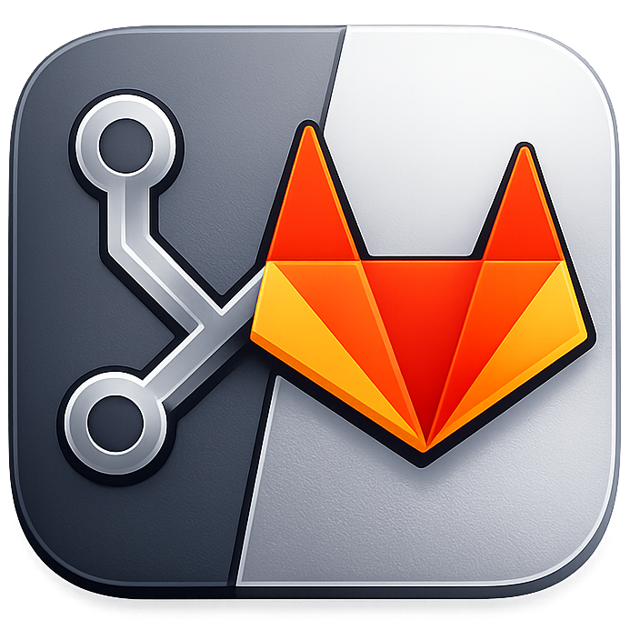

# Foxlab — GitLab Menubar Companion



Companion macOS orienté menubar pour suivre GitLab sans garder l’UI web ouverte en permanence.

## Ce que fait l’app
- Affiche vos MRs ouvertes (`assigned_to_me` + `reviews_for_me`).
- Affiche les derniers commentaires des MRs suivies.
- Affiche les tickets GitLab qui vous sont assignés.
- Ouvre directement la MR, le commentaire, le ticket ou le pipeline dans le navigateur.
- Notifie sur les nouveaux commentaires (hors commentaires de l’utilisateur courant).

## UX principale
- App tray-first: clic gauche sur l’icône pour afficher/masquer la popover.
- Clic droit sur l’icône tray: menu contextuel avec action `Quitter`.
- Fenêtre compacte always-on-top, pensée pour un usage rapide.
- Tabs compactes:
  - `Commentaires`
  - `MRs`
  - `Tickets`

## Fonctionnalités clés
- Polling GitLab configurable: `1`, `2`, `3` ou `5` minutes (défaut `2`).
- Refresh manuel.
- Unread sur commentaires + reset à l’ouverture de l’onglet Commentaires.
- Accordéon MR:
  - commentaires de discussion avec statut résolu/non résolu,
  - état CI par stages/jobs,
  - déclenchement des jobs CI manuels (quand GitLab le permet).
- Masquage des MRs "bruit" (atténuées et poussées en bas de liste).
- Labels de tickets affichés en badges colorés avec prise en compte de la hiérarchie `::`.
- Option de préférences pour afficher/masquer les avatars dans les commentaires.
- Thème `light` / `dark`.

## Stack technique
- Tauri v2 (Rust) + plugins:
  - `tauri-plugin-store`
  - `tauri-plugin-notification`
  - `tauri-plugin-opener`
- React 19 + TypeScript + Vite
- HeroUI v3 beta
- Tailwind CSS v4

## Installation (dev)
### Prérequis
- Bun
- Rust toolchain
- Xcode Command Line Tools (macOS)

### Lancer en local
```bash
bun install
bun run tauri dev
```

### Build
```bash
bun run build
bun run tauri build
```

### Versioning
Synchronise la version dans:
- `package.json`
- `src-tauri/tauri.conf.json`
- `src-tauri/Cargo.toml`

```bash
bun run version:patch
bun run version:minor
bun run version:major
bun run version:set -- 1.2.3
```

## Configuration GitLab
Dans `Réglages`, renseigner:
- `GitLab base URL` (`https://gitlab.com` ou instance self-hosted)
- `Personal Access Token` (scope API en lecture, et droits CI si déclenchement manuel de jobs)
- intervalle de synchronisation

## Persistance locale
Stocké localement via `tauri-plugin-store`:
- `settings.gitlabBaseUrl`
- `settings.personalAccessToken`
- `settings.pollIntervalMinutes`
- `settings.theme`
- `settings.mutedMrIids`
- `settings.showCommentAvatars`
- `state.lastSeenCommentAt`
- `state.lastNotifiedCommentAt`

## Notes produit / limites MVP
- macOS menubar first (pas de mode desktop "classique" complet).
- TLS strict (pas de bypass de certificat).
- Pas de mode offline avancé.
- Notifications centrées sur les nouveaux commentaires.

## Roadmap possible
- Filtres avancés (groupe/projet/labels).
- Actions MR supplémentaires (approve, assign, mark as draft).
- Gestion plus fine des notifications par projet/type d’événement.
